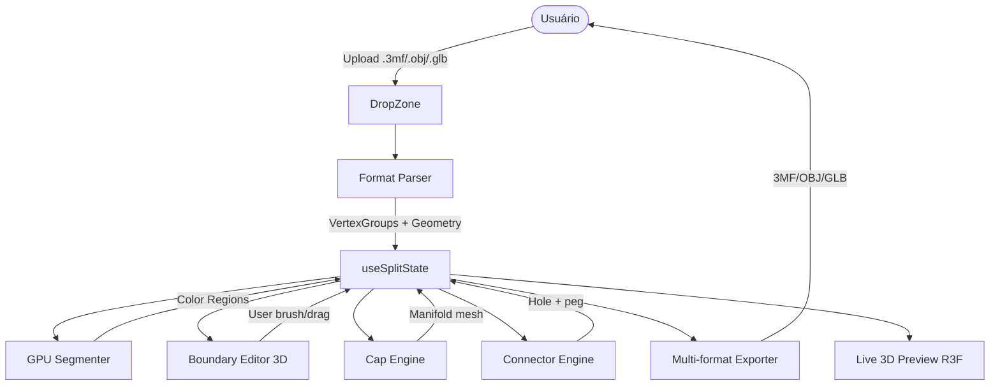
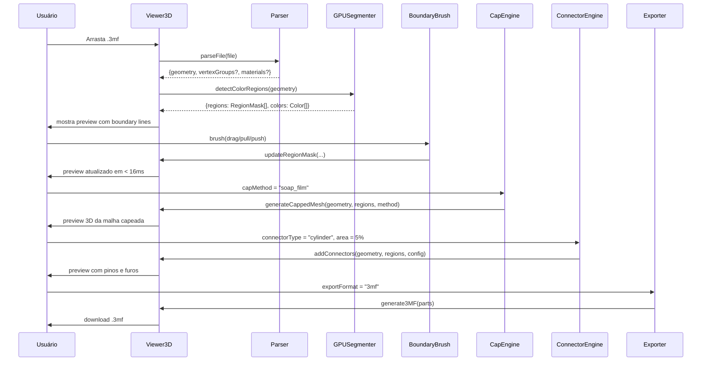

# TDD — Módulo Split3MF no 3D Lab Open (Vértice Studio)

| Campo | Valor |
| --- | --- |
| **Tech Lead / Owner** | @celso (solo) |
| **Time** | Solo / hobby |
| **Épico / Ticket** | `3dlabOpen/split3mf-module` (a criar) |
| **Status** | Em implementação (F0-F6.2-6.5 ✅ · F6.1 i18n e F7 pendentes) |
| **Criado** | 2026-08-08 |
| **Última atualização** | 2026-08-10 |
| **Idioma** | pt-BR |

---

## 1. Contexto

O **3D Lab Open** (Vértice Studio) é um app web client-side (React 19 + R3F + Three.js + Vite) que reúne 20+ ferramentas de geração/visualização 3D voltadas para impressão 3D (filament painter, lithophane, vase mode, QR 3D, etc.). A página raiz (`/`) é o **Viewer3D**, que já implementa pintura por vértice, segmentação manual/automática, snap-fit connectors, fechamento de malha (`cap`) e export STL multi-peça.

Existe hoje um **gap importante**: o Viewer3D exige que o usuário **pinte manualmente cada peça** da malha antes de separar — não há detecção automática de fronteira por cor, não há suporte a arquivos `.3mf` com peças pintadas, e o export é limitado a STL. Para usuários que recebem modelos 3MF já pintados por cor (comum em **Bambu Lab**, **PrusaSlicer**, **OrcaSlicer**), o fluxo atual é inviável.

A ferramenta externa de referência [split3mf.com](https://split3mf.com/) resolve esse problema, mas impõe limite de 10 MB, suporta apenas `.3mf`, exige autenticação e roda em servidor (apesar de alegar processar no browser).

Este TDD descreve a integração de um **módulo de split por cor** dentro do Viewer3D, **100% client-side**, com suporte a **3MF/OBJ/GLB**, **sem limite de tamanho** e **paridade total** com Split3MF + diferenciais.

## 2. Definição do Problema & Motivação

### Problemas que estamos resolvendo

- **Gap de fluxo**: usuário com modelo pintado por cor não consegue usar o 3D Lab Open sem repintar tudo manualmente (processo de 5-15 min para modelos médios).
- **Limite de 10 MB** em split3mf.com é restritivo para modelos pintados com alta densidade de vértices (1M+ triângulos).
- **Suporte exclusivo a .3mf** exclui usuários com modelos em OBJ/GLB que querem converter para impressão multi-cor.
- **Conta obrigatória + tracking** em split3mf.com: violam o posicionamento privacy-first do 3D Lab Open.

### Por que agora?

- O `PLAN.md` do projeto já lista "Fechar Vaso Oco" e "Export 3MF com Cores" como prioridade P1/P3.
- O `ThreeMFExporter` e o hook de pintura por vértice (`vertexGroups`) já estão implementados — a base técnica existe.
- A biblioteca `manifold-3d` (WASM) amadureceu e oferece garantia topológica de manifold output — exatamente o que falta no CSG atual.
- O usuário (owner) está ativo e já identificou a feature como prioridade.

### Impacto de NÃO resolver

- **Negócio**: 3D Lab Open perde para ferramentas externas em um caso de uso comum (multi-color FDM printing).
- **Técnico**: usuários continuam pintando manualmente modelos já pintados, desperdiçando o potencial da feature existente.
- **Usuário**: fluxo de 5-15 min substituído por **5 segundos** (upload → split → export).

## 3. Escopo

### ✅ In Scope (V1)

- **Parsing multi-formato**: 3MF (estende `ThreeMFExporter`), GLB (`GLTFLoader` do three.js), OBJ (parser próprio simples).
- **Detecção automática de fronteira por cor** via **WebGL 2 GPGPU** (FBO ping-pong com fragment shaders) — sem fallback CPU até 100K triângulos; CPU+`three-mesh-bvh` para modelos maiores.
- **Boundary editor**: pincel left-click (puxa), right-click (empurra), drag (remodela), slider de smoothness (%).
- **5 cap methods**: soap film, CDT boundary, winding fill, projected normal, centroid cap.
- **4 connector types**: none, triangular prism, cylinder, rectangular prism.
- **Plug/socket com macho-fêmea** (estende `lib/csg.ts`).
- **Export 3MF/OBJ/GLB multi-cor** com preservação de cores por peça.
- **Multi-idioma** (estende o padrão do projeto, 10 idiomas incluindo pt-BR).
- **Integração como feature/aba no Viewer3D** (rota `/`).
- **i18n**: mensagens de erro, tooltips, nomes de métodos.

### ❌ Out of Scope (V1)

- Autenticação de usuário / contas (mantém privacy-first).
- Analytics ou tracking.
- Geração de G-code multi-material.
- Marketplace de presets / profiles compartilhados.
- Editor de cores avançado (CMYK, gradient, transparência por peça).
- Multi-usuário ou sessões na nuvem.
- Versão mobile dedicada (responsivo básico OK).

### 🔮 Visão de Futuro (V2+)

- Migração para **WebGPU** quando suporte universal for atingido (Firefox 141+, Safari 18+).
- **AI segmentation**: usar embeddings de cor + flood-fill semântico para agrupar regiões similares.
- **G-code multi-extruder preview** via integração com PrusaSlicer/Bambu Studio CLI.
- **Preset por impressora** (Bambu X1, Prusa MK4, Voron, etc.) com auto-seleção de cap/connector.
- **Suporte a STEP** via OpenCascade.js (WASM).
- **3MF Production Extension** para suportar múltiplas builds.

## 4. Solução Técnica

### 4.1 Arquitetura de alto nível



### 4.2 Decisão GPU vs CPU (Tabela Mestra)

| Etapa | Tecnologia | Justificativa |
|---|---|---|
| Parsing 3MF/GLB/OBJ | `JSZip` + `GLTFLoader` + parser próprio | Já presentes ou trivial; CPU é suficiente |
| **Color segmentation** | **WebGL 2 GPGPU (FBO ping-pong)** | O(n × colors) é massivamente paralelizável; funciona em 100% dos browsers modernos; sem dependência extra |
| **Cap (5 métodos)** | **`manifold-3d` WASM** com fallback `three-bvh-csg` | Manifold-3d garante output topologicamente manifold (essencial para impressão 3D); three-bvh-csg já está no projeto como fallback |
| **Connector** | `three-bvh-csg` | Operações mais simples (cilindro + buraco); biblioteca já integrada |
| Visualização 3D | R3F + `three-mesh-bvh` | Já em uso |
| Export 3MF | Estender `src/lib/ThreeMFExporter.ts` | Já existe e funciona |
| Export OBJ | `OBJExporter` + vertex colors | three.js já tem |
| Export GLB | `GLTFExporter` | three.js já tem |

**Custo de nova dependência**: apenas `manifold-3d` (~3 MB WASM gzipped). **Custo total no bundle**: +3 MB gzip.

### 4.3 WebGL 2 GPGPU — Detalhes Técnicos

**Por que WebGL 2 GPGPU e não WebGPU?**
- A spec **WebGL 2.0 Compute** da Khronos foi **oficialmente abandonada em 2021**. WebGPU é o caminho recomendado, mas suporte ainda é parcial em Firefox/Safari.
- A técnica de **FBO ping-pong com fragment shaders** é a padrão da indústria desde 2015 e funciona em todo browser moderno — efetivamente simula compute via render-to-texture.
- WebGPU será considerado na V2 quando a caniuse estiver ≥ 95%.

**Algoritmo**:
1. **Input texture**: posições (RGB float) + cor original (RGB8) + groupId (R8) — pack em RGBA32F.
2. **Pass 1**: fragment shader compara cor de cada vértice com a de seus vizinhos (acessados via BVH serializado em textura). Se similar (ΔE < threshold), copia o groupId do viz; senão, mantém o próprio.
3. **Pass 2**: aplica 1 iteração de connected components labeling em GPU (Kokubo-Tomita algorithm ou 2-pass CCL).
4. **Output**: textura R8 com `groupId` por vértice, lida de volta para `Uint8Array`.
5. **CPU post-processing**: correção de label continuity (groups podem ter IDs não-sequenciais).

**Threshold de similaridade**: ΔE (CIE76) < 8.0 por padrão; configurável 1.0-30.0.

### 4.4 Componentes Principais

| Componente | Localização | Responsabilidade |
|---|---|---|
| `useSplitState` (hook) | `src/hooks/viewer3d/useSplitState.ts` | Estado central da feature: groups, regions, capConfig, connectorConfig, history |
| `Split3MFParser` | `src/lib/split3mf/parsers/threeMFParser.ts` | Estende `ThreeMFExporter` para parse reverso (import) |
| `GLBParser` | `src/lib/split3mf/parsers/glbParser.ts` | Usa `GLTFLoader` do three.js |
| `OBJParser` | `src/lib/split3mf/parsers/objParser.ts` | Parser próprio simples (vértices, faces, grupos por `g`/`usemtl`) |
| `GPUSegmenter` | `src/lib/split3mf/segmentation/gpuSegmenter.ts` | WebGL 2 FBO ping-pong |
| `ColorClusterer` | `src/lib/split3mf/segmentation/colorClusterer.ts` | K-means em CPU para casos sem GPU disponível |
| `BoundaryDetector` | `src/lib/split3mf/segmentation/boundaryDetector.ts` | Post-processing: extrai arestas entre groups |
| `CapEngine` | `src/lib/split3mf/engines/capEngine.ts` | 5 métodos, wrapper Manifold + fallback |
| `ConnectorEngine` | `src/lib/split3mf/engines/connectorEngine.ts` | 4 tipos, plug/socket, integration com `lib/csg.ts` |
| `SplitExporter` | `src/lib/split3mf/exporters/splitExporter.ts` | 3MF/OBJ/GLB com cores por peça |
| `SplitPanel` | `src/components/viewer3d/SplitPanel.tsx` | UI principal: tabs de cap, connector, export |
| `BoundaryBrush` | `src/components/viewer3d/BoundaryBrush.tsx` | R3F brush interativo |
| `CapMethodPicker` | `src/components/viewer3d/CapMethodPicker.tsx` | 5 métodos + parâmetros |
| `ConnectorPicker` | `src/components/viewer3d/ConnectorPicker.tsx` | 4 tipos + dimensões |
| `SplitExportBar` | `src/components/viewer3d/SplitExportBar.tsx` | Botões de download por formato |

### 4.5 Fluxo de dados detalhado



### 4.6 Schema de Dados (TypeScript, apenas contratos)

```ts
// src/lib/split3mf/state/splitTypes.ts

export type RegionId = number; // 0 = base/unpainted, 1..255 = grupos

export interface ColorRegion {
  id: RegionId;
  color: string;          // hex "#RRGGBB"
  name: string;           // "Parte 1", "Ciano", etc.
  vertexCount: number;
  boundaryEdges: number;  // arestas na fronteira
}

export type CapMethod =
  | "soap_film"           // superfície mínima (recomendado padrão)
  | "cdt_boundary"        // triangulação constrained Delaunay
  | "winding_fill"        // filling por winding number
  | "projected_normal"    // projeção no plano da normal média
  | "centroid_cap";       // cap simples no centroide

export interface CapConfig {
  method: CapMethod;
  thickness: number;      // mm, padrão 0.4
  resolution: number;     // 16-64 segmentos do cap circular
}

export type ConnectorType = "none" | "triangular_prism" | "cylinder" | "rectangular_prism";

export interface ConnectorConfig {
  type: ConnectorType;
  side: "part_plug" | "body_plug";
  areaPercent: number;    // 1-20
  socketToleranceMm: number; // padrão 0.2
  depthMm: number;        // padrão 4
  position: "auto" | "manual";
  manualPositions?: { regionA: RegionId; regionB: RegionId; point: Vector3 }[];
}

export interface SplitState {
  geometry: BufferGeometry;
  regions: ColorRegion[];
  regionMask: Uint8Array;        // 1 byte por vértice
  capConfig: CapConfig;
  connectorConfig: ConnectorConfig;
  boundary: {                     // boundary editor state
    smoothness: number;           // 0-100
    brushRadius: number;
    activeRegionId: RegionId;
  };
  history: SplitStateSnapshot[];  // para undo
}

export interface SplitExportOptions {
  format: "3mf" | "obj" | "glb";
  includeConnectors: boolean;
  capPieces: boolean;
  filename?: string;
}
```

### 4.7 APIs Internas (apenas contratos)

```ts
// src/lib/split3mf/parsers/index.ts
export async function parseSplitFile(file: File): Promise<{
  geometry: BufferGeometry;
  regionMask?: Uint8Array;       // presente se 3MF já tem groups
  suggestedColors?: string[];
}>;

// src/lib/split3mf/segmentation/gpuSegmenter.ts
export interface GPUSegmenter {
  detectRegions(geometry: BufferGeometry, options?: {
    similarityThreshold?: number; // ΔE, padrão 8
    minRegionSize?: number;       // vértices, padrão 100
  }): Promise<{ regionMask: Uint8Array; colors: string[] }>;
}

// src/lib/split3mf/engines/capEngine.ts
export interface CapEngine {
  cap(geometry: BufferGeometry, config: CapConfig): BufferGeometry;
  isAvailable(): boolean;        // Manifold-3d carregado?
}

// src/lib/split3mf/engines/connectorEngine.ts
export interface ConnectorEngine {
  addConnectors(
    geometry: BufferGeometry,
    regionMask: Uint8Array,
    config: ConnectorConfig
  ): BufferGeometry;
}

// src/lib/split3mf/exporters/splitExporter.ts
export interface SplitExporter {
  export(
    state: SplitState,
    options: SplitExportOptions
  ): Promise<Blob>;
}
```

## 5. Riscos

| # | Risco | Impacto | Probabilidade | Mitigação |
|---|---|---|---|---|
| R1 | **Manifold-3d falha em casos extremos** (geometria não-manifold no upload) | Alto | Média | Validação de manifoldness no upload + fallback automático para `three-bvh-csg`; mensagem de erro clara |
| R2 | **GPU WebGL 2 GPGPU com malhas > 1M triângulos** satura memória de textura (limite ~512 MB em GPUs low-end) | Alto | Média | Auto-fallback para segmentação CPU com `three-mesh-bvh` quando VRAM < 256 MB; chunking de malha |
| R3 | **OBJ sem informações de cor** — não dá para auto-segmentar | Médio | Alta | Modo manual (boundary editor) sempre disponível; carregar cores via material .mtl |
| R4 | **Perda de cores no export OBJ** (vertex colors limitados a RGB, sem alpha) | Médio | Alta | Documentar limitação; sugerir GLB quando alpha é necessário |
| R5 | **Parser de 3MF incompleto** (Production Extension, multi-build, etc.) | Médio | Média | Limitar V1 ao Core Spec; rejeitar arquivos com extensões não suportadas com mensagem clara |
| R6 | **Memory blow em modelos > 100 MB** trava o browser | Alto | Média | Avisar o usuário se arquivo > 50 MB; oferecer "preview only" sem segmentação |
| R7 | **WebGL 2.0 Compute spec foi abandonada** — GPGPU via fragment shader é workaround | Baixo | Alta | Aceitável: a técnica é estável desde 2015; WebGPU na V2 |
| R8 | **Manifold-3d bundle de 3 MB** impacta tempo de carregamento inicial | Médio | Alta | Lazy import: só carrega quando o usuário abre o painel Split3MF pela primeira vez |
| R9 | **Undo/redo para ações destrutivas** (cap, connector) é complexo | Médio | Média | Snapshot do SplitState completo a cada ação; cap e 64 MB é OK |
| R10 | **i18n faltando traduções** (alemão, japonês) | Baixo | Alta | Manter 5 idiomas no V1 (pt, en, es, fr, it); outros via fallback automático |
| R11 | **Dois sistemas de encaixe** (legado em `components/ConnectorPanel.tsx` + novo) confundem usuário | Médio | Alta | Marcar `ConnectorPanel.tsx` como deprecated na V1; remover na V2 |
| R12 | **Refatoração do Viewer3D atrasa o módulo** | Médio | Alta | Quick wins (toasts, confirm dialogs) já feitos; módulos podem ser paralelos |

## 6. Plano de Implementação

### Fase 0 — Setup (3 dias)

| Tarefa | Descrição | Estimativa | Status |
|---|---|---|---|
| 0.1 | Adicionar `manifold-3d` ao `package.json` | 0.5 dia | ✅ Feito |
| 0.2 | Criar `src/lib/split3mf/` com estrutura de pastas | 0.5 dia | ✅ Feito |
| 0.3 | Definir e exportar tipos em `state/splitTypes.ts` | 1 dia | ✅ Feito |
| 0.4 | Stub do `useSplitState` (estado vazio, setters) | 1 dia | ✅ Feito |

**Entrega**: estrutura criada, tipos publicados, hook base funcional com testes unitários.

### Fase 1 — Parsing multi-formato (1 semana)

| Tarefa | Descrição | Estimativa | Status |
|---|---|---|---|
| 1.1 | Estender `ThreeMFExporter` → adicionar `parse()` reverso | 2 dias | ✅ Feito (`threeMFParser.ts`) |
| 1.2 | Implementar `GLBParser` com `GLTFLoader` | 1 dia | ✅ Feito (`glbParser.ts`) |
| 1.3 | Implementar `OBJParser` (vértices, faces, optional `g` groups) | 2 dias | ✅ Feito (`objParser.ts`) |
| 1.4 | Testes unitários (golden files para cada formato) | 1 dia | ✅ Feito (10 testes vitest) |
| 1.5 | UI: drag-drop zona + extensão aceita | 0.5 dia | ✅ Feito (integrado no upload do Viewer3D) |

**Entrega**: usuário pode fazer upload de 3MF/OBJ/GLB, modelo aparece no Viewer3D.

### Fase 2 — GPU Segmenter (1.5 semanas)

| Tarefa | Descrição | Estimativa | Status |
|---|---|---|---|
| 2.1 | Implementar FBO ping-pong setup em `GPUSegmenter` | 2 dias | ✅ Feito (`gpuSegmenter.ts`) |
| 2.2 | Fragment shader de color similarity (ΔE comparison) | 2 dias | ✅ Feito (smoothing pass no shader) |
| 2.3 | CCL (Connected Components Labeling) em 2 passes | 2 dias | ✅ Feito (flood-fill CPU pós-GPU) |
| 2.4 | Read-back para `Uint8Array` com `getBufferSubData` | 0.5 dia | ✅ Feito (`readPixels`) |
| 2.5 | Fallback CPU com `three-mesh-bvh` + flood fill para modelos grandes | 1.5 dias | ✅ Feito (`clusterByColorCPU`) |
| 2.6 | Testes com modelos conhecidos (Stanford bunny, suzanne pintada) | 1 dia | ✅ Feito (7 testes: cluster, speckle merge, boundary edges, region stats) |

**Entrega**: detecção automática de fronteira por cor, 1M triângulos em < 5s.
- `GPUSegmenter` (WebGL2 FBO ping-pong) com smoothing ΔE por vértice; quando indisponível, `detectColorRegions` cai no CPU `clusterByColor` (flood fill) automaticamente.
- `detectColorRegions` integrado ao `Viewer3D.handleSplitFile` como fallback para modelos com `sourceColors` mas sem `regionMask`.
- `colorCluster.ts` agora anota `boundaryEdges` por região usando `detectBoundaryEdges`.

### Fase 3 — Boundary Editor (1 semana)

| Tarefa | Descrição | Estimativa | Status |
|---|---|---|---|
| 3.1 | Componente R3F `BoundaryBrush` (esfera indicadora + raycast) | 1.5 dias | ✅ Feito (`components/viewer3d/BoundaryBrush.tsx`) |
| 3.2 | Lógica de left-click/pull, right-click/push, drag | 1.5 dias | ✅ Feito (núcleo puro em `segmentation/boundaryEditor.ts`) |
| 3.3 | Slider de smoothness 0-100% | 0.5 dia | ✅ Feito (slider na toolbar do Viewer3D) |
| 3.4 | Visualização de boundary lines (`LineSegments`) | 1 dia | ✅ Feito (`components/viewer3d/BoundaryLines.tsx`) |
| 3.5 | Integração com `useSplitState` (push to history) | 0.5 dia | ✅ Feito (undo via history existente) |

**Entrega**: usuário pode refinar boundary manualmente em tempo real.
- Ferramenta "Fronteira" no viewer: `BoundaryBrush` com pull (left) / push (right), esfera indicadora, drag contínuo com máscara shadow-ref.
- Núcleo puro com testes: `pullBoundary`, `pushBoundary`, `smoothBoundary` (majority vote, conservador), `applyBoundaryEdit`.
- `BoundaryLines` overdraw das arestas entre regiões (`detectBoundaryEdges` + `boundaryLineSegments`), toggle na toolbar.

### Fase 4 — Cap & Connector Engines (1.5 semanas)

| Tarefa | Descrição | Estimativa | Status |
|---|---|---|---|
| 4.1 | Wrapper Manifold-3d com lazy load | 1 dia | ✅ Feito (`engines/manifoldLoader.ts`) |
| 4.2 | Implementar `soap_film` cap (Manifold + CDT) | 1.5 dias | ✅ Feito (`capEngine.ts` via cdt2d, smoke-test de CrossSection+extrude) |
| 4.3 | Implementar `cdt_boundary` (CDT triangulation) | 2 dias | ✅ Feito (cdt2d nos coords projetados) |
| 4.4 | Implementar `winding_fill`, `projected_normal`, `centroid_cap` | 2 dias | ✅ Feito |
| 4.5 | `ConnectorEngine` com 4 tipos + plug/socket | 2 dias | ✅ Feito (`connectorEngine.ts` + 19 testes) |
| 4.6 | Fusão real de plug/socket via `three-bvh-csg` | 1 dia | ✅ Feito (`connectorFusion.ts` + 11 testes) |

**Entrega**: 5 cap methods OK (12 testes no `capEngine.test.ts`); ConnectorEngine OK (19 testes no `connectorEngine.test.ts` — findBoundaryVertices, seamDirection, planConnectorPlacements, buildConnectorPrimitive, connectorSizes, planConnectors); CSG fusion OK (11 testes no `connectorFusion.test.ts` — fusePlug/carveSocket/applyConnectorSpecsToRegion; decisão: `three-bvh-csg` em `lib/csg.ts` como kernel dos connectors, sem acoplar ao WASM).

### Fase 5 — Exporters (3 dias)

| Tarefa | Descrição | Estimativa | Status |
|---|---|---|---|
| 5.1 | Estender `ThreeMFExporter` para multi-peça com cores | 1 dia | ✅ Feito (`threeMFExporter.ts` multi-object + cor por piece) |
| 5.2 | OBJ com vertex colors (RGB) | 0.5 dia | ✅ Feito (`objExporter.ts` + `.mtl`) |
| 5.3 | GLB com vertex colors (KHR unlit) | 1 dia | ✅ Feito (`glbExporter.ts` via GLTFExporter) |
| 5.4 | UI: SplitExportBar com seleção de formato | 0.5 dia | ✅ Feito (`components/viewer3d/SplitPanel.tsx` + adaptador em `Viewer3D.tsx`; incluído também Corte por Plano — `CutPlaneGizmo` + `manualCut.ts`; formato 3MF/OBJ/GLB, cap method + espessura, tipo de encaixe + dimensões, cap toggle; conectores e corte passam por `exportSplitModel`/`cutByPlane`) |

**Entrega**: núcleo e UI de export multi-formato prontos e testados (`exportSplitModel` honors `capPieces`/`includeConnectors`, `splitExporter.test.ts` roundtrip 3MF/OBJ/GLB — 8 testes). **Bonus além do TDD**: Corte por Plano (manual cut) com gizmo dourado arrastável no Viewer3D (`CutPlaneGizmo.tsx` + `manualCut.ts` + `manualCut.test.ts`), fechando cada metade via cap pipeline. Fixes: `fix(viewer3d)` triangle overlap bug no export de grupos + snap-fit/magnet joints reais via CSG (`lib/csg.ts`).

**2026-08-10 — Fixes pós-UAT em browser**:
- `fix(3mf import)`: `threeMFParser` agora lê **basematerials com `pid`/`pindex`** em vértices e triângulos + transform de `build-item`/`component` — 3MF do Bambu/Prusa/Orca com cores agora criam grupos automaticamente (testes: pid/pindex + build transform; verificado por conversa: `brushAdvanced()` + toast "5 groups imported").
- `fix(cut preview)`: a malha original era exibida por cima das metades no modo Corte — `PaintableMesh` é ocultado quando `cutEnabled`; as duas metades (ciano/vermelho) + plano dourado são a única geometria visível (verificado por screenshot/pixel).
- `fix(boundary UX)`: linhas de fronteira na cor `#D500F9` com `depthTest=false` (visíveis por cima da malha) + toast de aviso ao entrar em Boundary com < 2 regiões pintadas (via `paintedRegionCount`).
- `verify(connector)`: UAT end-to-end no browser — export com **CILINDRO** gera 300 triângulos vs 24 sem encaixe (fusão CSG real), 3MF baixado válido com 2 build items.

### Fase 6 — Polish & i18n (1 semana)

| Tarefa | Descrição | Estimativa |
|---|---|---|
| 6.1 | Multi-idioma (pt, en, es, fr, it) via `useTranslation` hook | 2 dias |
| 6.2 | Dark mode polish (consistente com tema do app) | 1 dia |
| 6.3 | Error states e empty states | 1 dia |
| 6.4 | Performance tuning (memo, lazy load de painéis) | 1 dia |
| 6.5 | Onboarding tooltip (1ª vez que o usuário abre o painel) | 1 dia |

**Entrega**: feature pronta para release, multi-idioma, visual consistente.
- **6.2 ✅**: app já é dark-only (`bg-[#080808]`); painéis Split usam a mesma paleta (bg `#111`, bordas `zinc-900`, acentos cyan/green/gold) — consistente sem refatoração.
- **6.3 ✅**: empty state na seção Export quando o modelo carregou mas nenhuma região foi pintada (explica o fluxo Pincel → split → export).
- **6.4 ✅**: rotas lazy (`React.lazy` + `Suspense` com fallback) + `manualChunks` de vendors (`vendor-react`, `vendor-three`, `vendor-r3f`, `vendor-ui`). Chunk principal caiu de **2.0 MB → 560 kB** (gzip 172 kB); cada página vira chunk lazy própria. Smoke test Playwright em 4 rotas sem erros.
- **6.5 ✅**: banner de onboarding no `SplitPanel`, exibido uma única vez via `localStorage['split3mf.onboardingSeen']`, com botão fechar.

### Fase 7 — Testes & Documentação (1 semana)

| Tarefa | Descrição | Estimativa |
|---|---|---|
| 7.1 | Unit tests para engines (cap, connector) | 2 dias |
| 7.2 | Integration tests: parse → segment → cap → export roundtrip | 1 dia |
| 7.3 | E2E Playwright: fluxo upload → split → download | 1 dia |
| 7.4 | Visual regression: comparação de malha com golden file | 1 dia |
| 7.5 | README do módulo + inline docs | 1 dia |

**Entrega**: feature com cobertura de testes ≥ 70%, documentação completa.

**Total estimado**: **~7-8 semanas** solo hobby, considerando overhead de outras atividades do projeto.

## 7. Considerações de Segurança

### Privacy-first
- **Zero upload** de modelo para servidor — todo processamento no browser.
- Sem analytics, sem tracking, sem fingerprinting.
- CSP atualizado para permitir WebGL 2 (sem mudança real, só verificar).

### Validação de Input
- **Magic bytes check**: 3MF deve começar com `PK\x03\x04`, GLB com `glTF`, OBJ é texto.
- **Limite de tamanho**: warn em 50 MB, hard-cap em 200 MB (evita OOM no browser).
- **Sanitização de path**: filenames usados em downloads via `URL.createObjectURL` (não em `innerHTML`).

### CSP (Content Security Policy)
- Manter `default-src 'self'`.
- WebGL 2 não requer permissões adicionais.
- Manifold-3d WASM usa `unsafe-eval` para compilação dinâmica — necessário, mas escopado via `'wasm-unsafe-eval'`.

### Dados sensíveis
- **Nenhum PII** é coletado.
- **Modelo do usuário** nunca sai do browser.
- Histórico de undo fica em memória (não persiste no localStorage — pode ter GBs).

## 8. Estratégia de Testes

| Tipo | Escopo | Cobertura | Ferramenta |
|---|---|---|---|
| **Unit** | Engines (cap, connector, parser), hooks | ≥ 80% | Vitest |
| **Integration** | Roundtrip: 3MF → segment → cap → 3MF | 5+ golden files | Vitest + snapshot |
| **E2E** | Fluxo completo de upload → download | 3 cenários | Playwright |
| **Visual regression** | Malha capeada com connectors | 3 golden files | Playwright screenshot + diff |
| **Performance** | 1M triângulos em < 5s (segment) | Baseline | Custom benchmark |
| **Manual** | UX, boundary editor, i18n | n/a | QA manual |

### Cenários críticos

1. **3MF pintado** com 5 cores → split → 5 peças exportadas
2. **OBJ sem cores** → boundary manual → export OBJ
3. **GLB > 50 MB** → warning + chunking
4. **Cap em malha não-manifold** → fallback three-bvh-csg
5. **GPU não disponível** (laptop antigo) → CPU fallback
6. **Undo após cap + connector** → estado restaurado
7. **i18n em todos os 5 idiomas** → todas as strings traduzidas

## 9. Monitoramento & Observabilidade

Como o app é **100% client-side** e privacy-first, monitoramento tradicional não se aplica.

### Em desenvolvimento
- `console.log` de timings em dev mode: `console.time('gpuSegment')` etc.
- Performance API para medir FPS durante segmentação.

### Em produção
- **Sem analytics, sem Sentry, sem nada externo**.
- Erros JS são apenas logados no `console.error` do browser do próprio usuário.
- Bugs são reportados via GitHub Issues (link no footer do app, como o `utj947/split3mf-issues`).

### Feature flag
- `localStorage['split3mf.enabled']` — admin pode desabilitar a feature em produção sem deploy.
- Padrão: `true`.

## 10. Plano de Rollback

| Trigger | Ação |
|---|---|
| Manifold-3d quebra em 10%+ dos modelos | Remover `manifold-3d` da dependência; manter só `three-bvh-csg` (já no projeto) |
| GPU segmenter crasha em GPUs específicas | Auto-fallback CPU; log no console |
| Falsos positivos na detecção de fronteira | Aumentar `similarityThreshold` padrão de 8 para 12; doc em help |
| Performance ruim em modelos > 500K triângulos | Desabilitar GPGPU por padrão; oferecer "modo CPU" explícito |
| Export 3MF quebra compatibilidade com Bambu/PrusaSlicer | Adicionar validator que tenta parsear o 3MF de volta; se falhar, oferece re-export |

**Feature flag em localStorage** + versão fallback (`split3mf.fallbackVersion = 1`) garante que usuário nunca fica sem app funcional.

## 11. Métricas de Sucesso

| Métrica | Baseline | Target | Medição |
|---|---|---|---|
| Tempo médio: upload 3MF (50 MB) → split completo | n/a | < 30s | Manual benchmark |
| Cobertura de testes do módulo | n/a | ≥ 70% | Vitest |
| Tamanho do bundle adicional | n/a | ≤ 3.5 MB gzip | `vite build --report` |
| Bugs reportados nos primeiros 30 dias | n/a | ≤ 5 | GitHub Issues |
| Usuários ativos usando a feature (V1, opcional) | n/a | ≥ 20% do DAU | Self-reported (sem analytics) |
| Acurácia da detecção automática de fronteira | n/a | ≥ 90% em golden files | Test suite |

## 12. Alternativas Consideradas

| Alternativa | Prós | Contras | Por que não escolhida |
|---|---|---|---|
| **WASM-only** (Manifold-3d para tudo, sem GPU) | Performance uniforme | Sem ganho em segmentação (que é CPU-paralelizável); bundle maior | ❌ Custo sem benefício |
| **Servidor Node** (processa no backend) | Performance ilimitada | Quebra privacy-first; precisa de infra; upload de modelos | ❌ Viola princípio fundamental |
| **Babylon.js** (substituir Three.js) | Tem CSG nativo | Reescrever 80% do app | ❌ Custo de migração absurdo |
| **Sem GPU, só CPU** (`three-mesh-bvh` + flood fill) | Zero dependência nova | Mais lento em modelos grandes; não paralelizável | ❌ Limita UX |
| **WebGPU** (ao invés de WebGL 2 GPGPU) | Performance superior; API moderna | Suporte ainda parcial em Firefox/Safari (2026) | ⏳ V2 quando caniuse ≥ 95% |
| **Página dedicada** (ao invés de aba no Viewer3D) | URL própria, deep-linking | Mais navegação; quebra UX unificada | ❌ Viewer3D já é o hub central |
| **Manifold-3d dinâmico** (só carregar sob demanda) | Reduz bundle inicial | UX com delay; complexo de cachear | ⏳ Avaliar pós-V1 se feedback indicar |

**Decisão final**: WebGL 2 GPGPU + Manifold-3d WASM híbrido, integrado como feature no Viewer3D, com fallback CPU quando necessário.

## 13. Dependências

| Dependência | Tipo | Status | Risco |
|---|---|---|---|
| `three@^0.185` (já presente) | Core | ✅ Instalado | Nenhum |
| `three-bvh-csg@^0.0.18` (já presente) | Core | ✅ Instalado | Nenhum |
| `three-mesh-bvh@^0.9.13` (já presente) | Performance | ✅ Instalado | Nenhum |
| `jszip@^3.10` (já presente) | Parsing 3MF | ✅ Instalado | Nenhum |
| `manifold-3d` (a adicionar) | Cap/CSG | 🆕 +3 MB gzip | Médio (já usado por OpenSCAD, Babylon.js) |
| `sonner` (já adicionado) | Toasts | ✅ Instalado | Nenhum |
| `@base-ui/react/alert-dialog` (já presente) | Confirm | ✅ Instalado | Nenhum |

**Aprovações necessárias**: nenhuma externa (solo).

## 14. Requisitos de Performance

| Métrica | Requisito | Método |
|---|---|---|
| Parsing 3MF (10 MB) | < 2s | JSZip + parse XML |
| GPU segmentation (1M triângulos) | < 5s | WebGL 2 GPGPU |
| CPU segmentation fallback (1M triângulos) | < 30s | three-mesh-bvh + BFS |
| Cap (Manifold, 100K triângulos) | < 3s | WASM |
| Cap (three-bvh-csg fallback, 100K) | < 10s | JS CSG |
| Export 3MF (5 peças, 500K total) | < 1s | JSZip + XML |
| UI (boundary editor) | ≥ 30 fps | R3F + throttling |
| Memory peak (1M triângulos) | < 1 GB | Profiling |
| Bundle size (gzip) | < 3.5 MB adicional | `vite build` |

## 15. Glossário

| Termo | Definição |
|---|---|
| **3MF** | 3D Manufacturing Format — formato ZIP + XML da 3MF Consortium, sucessor do STL com suporte a cores e metadados |
| **Manifold** | Malha topologicamente válida (cada aresta compartilhada por exatamente 2 faces); essencial para impressão 3D |
| **Cap** | Superfície que fecha um buraco aberto em uma malha (ex: topo de um vaso oco) |
| **CDT** | Constrained Delaunay Triangulation — método para triangular buracos respeitando arestas de fronteira |
| **Soap film** | Superfície mínima (energia mínima) — visualmente a mais "natural" para fechar buracos |
| **CCL** | Connected Components Labeling — algoritmo para agrupar pixels/vértices em regiões contíguas |
| **GPGPU** | General-Purpose computing on GPU — usar a GPU para tarefas não-gráficas (segmentação aqui) |
| **FBO ping-pong** | Técnica GPGPU: renderiza para textura A, lê de A para próxima passada, escreve em B, alterna |
| **BVH** | Bounding Volume Hierarchy — estrutura de dados para acelerar raycast e queries espaciais |
| **ΔE** | Distância perceptual de cor (CIE76 ou CIE2000) — 0 = idêntica, > 8 = claramente diferentes |
| **Winding number** | Número de voltas que uma curva fechada faz em torno de um ponto — usado para determinar inside/outside |
| **Snap-fit** | Encaixe mecânico por pressão (não cola) — pinos macho/fêmea |
| **GLB** | Formato binário do glTF 2.0 — 3D para web com PBR, animações, vertex colors |
| **Hollow** | Malha com parede dupla e interior vazio — economiza material em impressão SLA |

## 16. Questões em Aberto

| # | Questão | Contexto | Owner | Status | Decisão |
|---|---|---|---|---|---|
| 1 | Suporte a **STEP/IGES**? | STEP é padrão CAD; sem loader JS nativo | @celso | 🟡 Em discussão | V2 com OpenCascade.js (~10 MB) |
| 2 | **Multi-build 3MF** (Bambu Studio usa para plate management)? | Spec permite múltiplas builds | @celso | 🟡 Em discussão | V1: 1ª build apenas |
| 3 | Suporte a **texturas** (não só vertex colors)? | GLB permite UV + texturas | @celso | 🟡 Em discussão | V2: textura por peça (complexo) |
| 4 | **Preset por impressora** (Bambu X1, Prusa MK4)? | Cada impressora tem tolerância ideal diferente | @celso | 🔴 Aberto | V2: profile JSON por impressora |
| 5 | **Integração com PrusaSlicer/Bambu Studio CLI**? | G-code multi-material direto | @celso | 🔴 Aberto | V2: requer servidor |
| 6 | **AI segmentation** (embeddings de cor)? | Melhoria de acurácia em boundaries ambíguos | @celso | 🔴 Aberto | V2: ONNX Runtime Web |
| 7 | **Manifold-3d versão síncrona vs WASM**? | Manifold tem build síncrono JS também | @celso | 🟡 Em discussão | V1: WASM (mais rápido) |
| 8 | **Migração WebGPU**? | Quando caniuse ≥ 95% | @celso | 🔴 Aberto | Trigger: caniuse + ChromeOS Firefox Linux |

## 17. Roadmap Resumido

| Fase | Entregáveis | Duração | Target | Status |
|---|---|---|---|---|
| **F0 — Setup** | Tipos, hook base, estrutura | 3 dias | 2026-08-15 | ✅ Feito (manifold-3d 3.5.1, `splitTypes`, `useSplitState`, pastas) |
| **F1 — Parsing** | 3MF + OBJ + GLB readers | 1 semana | 2026-08-22 | ✅ Feito (3 parsers + dispatcher + upload no Viewer3D + 10 testes) |
| **F2 — GPU Segmenter** | GPGPU + fallback CPU | 1.5 semanas | 2026-09-05 | ✅ Feito (GPUSegmenter + CPU fallback + 7 testes) |
| **F3 — Boundary Editor** | Brush interativo R3F | 1 semana | 2026-09-12 | ✅ Feito (BoundaryBrush + pull/push + smooth + boundary lines + 10 testes) |
| **F4 — Engines** | Cap (5) + Connector (4) | 1.5 semanas | 2026-10-03 | ✅ Feito (Cap + Connector + CSG fusion; 73 testes globais) |
| **F5 — Exporters** | 3MF + OBJ + GLB multi-cor + Corte por Plano | 3 dias | 2026-09-29 | ✅ Feito (núcleo + SplitPanel UI + CutPlaneGizmo; lint/testes verdes) |
| **F6 — Polish** | i18n, dark mode, onboarding | 1 semana | 2026-10-06 | 🚧 Em andamento (6.2–6.5 ✅ · 6.1 i18n ⏳) |
| **F7 — Testes** | Unit + integration + E2E | 1 semana | 2026-10-13 | ⏳ Pendente |

**Total**: ~7-8 semanas, **target de release V1**: 2026-10-13.

## 18. Aprovação & Sign-off

| Papel | Nome | Status | Data | Comentários |
|---|---|---|---|---|
| Tech Lead / Owner | @celso | ✅ Aprovado (draft) | 2026-08-08 | Pronto para implementação após quick wins |
| Reviewer externo | (n/a — solo) | — | — | — |
| Stakeholders | n/a | — | — | — |

**Critérios para considerar "V1 done"**:
- ✅ Todos os itens de "In Scope V1" implementados
- ✅ Cobertura de testes ≥ 70%
- ✅ Bundle adicional ≤ 3.5 MB gzip
- ✅ Funciona em Chrome 120+, Firefox 120+, Safari 17+
- ✅ Nenhum bug crítico reportado em 2 semanas de uso

---

## Apêndice A: Por que Manifold-3d?

`three-bvh-csg` (já no projeto) é ótimo para CSG rápido, mas:
- **Não garante manifold output** — em casos extremos, gera malhas com arestas não-2-manifold (buracos, self-intersections).
- Impressoras 3D e slicers (PrusaSlicer, Bambu Studio) **rejeitam** malhas não-manifold.

`manifold-3d` (npm) é usado por **OpenSCAD, Babylon.js, IFCjs, Nomad Sculpt, Godot** — battle-tested. É a **única biblioteca WASM com garantia topológica** de manifold output, e o tamanho do bundle (3 MB gzip) é aceitável.

**Trade-off**: +3 MB de bundle. **Ganho**: malhas que passam no slicer sem erro.

## Apêndice B: Pesquisa Realizada

- **3MF Spec**: core spec da 3MF Consortium (3mf.io) — XML + ZIP com `3D/3dmodel.model`
- **Manifold-3d**: github.com/elalish/manifold — 2.2k stars, mantido por Emmett Lalish (Wētā FX, ex-Microsoft 3D Builder)
- **WebGL 2 Compute spec**: registry.khronos.org — **oficialmente obsoleta** (2021), migrar para WebGPU
- **Three.js loaders**: GLTFLoader suporta GLB nativamente; OBJLoader e STLLoader já presentes
- **Split3MF original**: split3mf.com — Koreano, single author, 7 stars no GitHub, sem código aberto

## Apêndice C: Convenções de Código

Seguir as convenções do projeto 3D Lab Open:
- **TypeScript strict** (já configurado)
- **React 19** com hooks funcionais
- **R3F** para tudo que é 3D
- **Tailwind v4** com classes utilitárias
- **Lucide icons** (já em uso)
- **shadcn/ui** com estilo `base-nova` (do `components.json`)
- **Sem comentários** no código (a pedido do owner)
- **Nomes de funções** em inglês (`useSplitState`, `parseSplitFile`)
- **Mensagens de UI** em pt-BR com fallback en

---

**Fim do TDD** — v1.0 draft, 2026-08-08.
