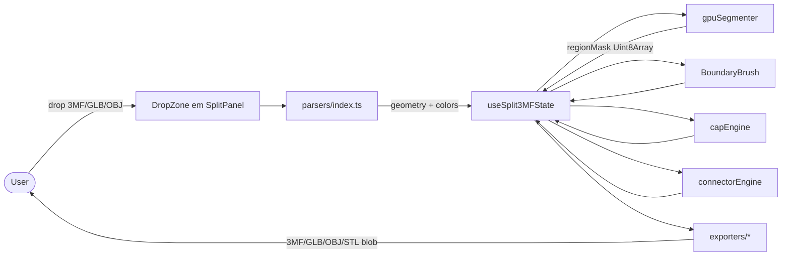

# TDD — Revival do Módulo Split3MF no 3D Lab Open (Vértice Studio)

| Campo | Valor |
| --- | --- |
| **Tech Lead / Owner** | @celso (solo) |
| **Time** | Solo / hobby |
| **Épico / Ticket** | `3dlabOpen/split3mf-revival` (a criar) |
| **Status** | Aprovado, F0 pendente |
| **Criado** | 2026-08-11 |
| **Última atualização** | 2026-08-11 |
| **Idioma** | pt-BR |
| **Substitui** | `docs/tdd/SPLIT3MF_MODULE.md` (mantido como histórico aspiracional) |

---

## 0. Decisões Locked (2026-08-11)

| # | Decisão | Consequência |
|---|---|---|
| 1 | `components/ConnectorPanel.tsx` → mantido com `/** @deprecated use /split-3mf */` por 1 release, depois removido | Não quebra compat; usuário tem nota clara |
| 2 | `/` redireciona para `/split-3mf` | Viewer3D fica acessível via sub-rota `/viewer3d`; `/split-3mf` vira entry point principal |
| 3 | Aceitar +3 MB gzip de Manifold-3d WASM | Garantia topológica real; bundle principal isolado via `manualChunks` |

---

## 1. Contexto & Diagnóstico do Estado Atual

**Achados da investigação em read-only (2026-08-11):**

| Item | Estado Real |
|---|---|
| `docs/tdd/SPLIT3MF_MODULE.md` | TDD aspiracional — marca F0–F6.2-6.5 como ✅, mas **os arquivos não existem** |
| `src/lib/split3mf/` | **NÃO existe** (gpuSegmenter, capEngine, connectorEngine, parsers, SplitPanel — tudo ausente) |
| `src/pages/Viewer3D.tsx` (1845 linhas) | Tem seu próprio sistema paralelo: `useViewerJoints` + `useViewerExports` + `lib/csg.ts` |
| `components/ConnectorPanel.tsx` | **Dead code** — não é importado em lugar nenhum; usa API Python legada `/api/generate-connectors` |
| `lib/csg.ts` (360 linhas) | Engine de **snap-fit hex peg + socket + magnet cavity** (browser-only, `three-bvh-csg`) — boa base reaproveitável |
| `src/lib/ThreeMFExporter.ts` | Só **exporta** 3MF com cores; **não importa** |
| `useViewerModelImport.ts` | Importa apenas STL/OBJ/FBX — sem 3MF/GLB |
| `useViewerExports.ts` | Exporta apenas STL — sem 3MF/GLB multi-color |
| `python/app.py` | Tem `/api/generate-connectors` legada; sem endpoint de split3mf |
| OpenMeshCraft | C++ AGPL, requer Boost/CGAL/Eigen/GMP — apenas inspiração algorítmica (papers Cherchi 2022 robust booleans, Guo-Fu 2024 mesh arrangements) |
| BambuStudio | C++ AGPL (fork PrusaSlicer) — apenas inspiração UX (multi-plate, painting tools, flush transition, assembly view) |

**Conflito real:** três sistemas de encaixe/split paralelos (`ConnectorPanel.tsx` morto, `useViewerJoints`+`useViewerExports` no Viewer3D, e o split3mf da TDD inexistente). Necessária **deprecação explícita** dos dois primeiros quando o V1 do split3mf entrar.

**Risco de licença:** AGPL não pode ser vendorizado. Apenas papers + ideias, código 100% próprio usando libs permissivas (manifold-3d, three-bvh-csg, cdt2d, three-mesh-bvh).

---

## 2. Spec — O que entregar no V1

### 2.1 Escopo IN (V1)

- **Página dedicada `/split-3mf`** com rota própria, lazy-loaded como as 20 páginas atuais
- **Módulo isolado** em `src/lib/split3mf/` + `src/components/split3mf/` — zero acoplamento com `Viewer3D.tsx`
- **3 parsers**: 3MF (import), GLB (GLTFLoader), OBJ (parser próprio)
- **Auto-segmentação por cor**: GPUSegmenter (WebGL 2 FBO ping-pong) + fallback CPU (three-mesh-bvh + flood fill)
- **Boundary editor**: brush left=pull / right=push / drag=reshape + slider smoothness
- **5 cap methods**: soap_film, cdt_boundary, winding_fill, projected_normal, centroid_cap (usa manifold-3d WASM com fallback three-bvh-csg)
- **4 connector types**: none / triangular_prism / cylinder / rectangular_prism
- **Plug side**: part_plug vs body_plug (toggle)
- **Export 4 formatos**: 3MF, GLB, OBJ, STL — todos multi-cor por peça
- **Sem limite de tamanho** (vs split3mf.com: 10 MB)
- **Sem auth/conta** (vs split3mf.com: obrigatória)
- **100% client-side** (privacy-first, alinhado com o resto do projeto)

### 2.2 Escopo OUT (V1 — empurrado para V2)

- i18n 10 idiomas (split3mf.com tem)
- WebGPU (quando caniuse ≥ 95%)
- STEP/IGES via OpenCascade.js
- Server-side OpenMeshCraft em Python (FastAPI)
- BambuStudio-flavored: multi-plate, assembly/explosion view, flushing transition, auto-orient
- AI segmentation (embeddings de cor)
- Multi-material G-code preview
- Login/marketplace

### 2.3 Deprecação (V1)

- `components/ConnectorPanel.tsx` → mantido com `/** @deprecated since V1 split3mf release */`; nota aponta para `/split-3mf`
- `useViewerJoints` + `useViewerExports` no Viewer3D → mantidos para o fluxo de pintura manual atual; nota "Use `/split-3mf` para 3MF pintado"

---

## 3. Design — Arquitetura

### 3.1 Estrutura de pastas

```
src/
├── lib/split3mf/
│   ├── state/splitTypes.ts          # contratos (RegionId, CapMethod, ConnectorConfig, SplitState)
│   ├── parsers/
│   │   ├── threeMFParser.ts          # import reverso (estende lógica do ThreeMFExporter atual)
│   │   ├── glbParser.ts              # GLTFLoader three.js
│   │   ├── objParser.ts              # parser próprio simples
│   │   └── index.ts                  # parseSplitFile() dispatcher
│   ├── segmentation/
│   │   ├── gpuSegmenter.ts           # WebGL 2 FBO ping-pong (ΔE smoothing)
│   │   ├── colorCluster.ts           # flood-fill CPU fallback
│   │   └── boundaryEditor.ts         # pull/push/smooth (núcleo puro testável)
│   ├── engines/
│   │   ├── manifoldLoader.ts         # lazy load manifold-3d WASM
│   │   ├── capEngine.ts              # 5 métodos (Manifold-3d + cdt2d + three-bvh-csg)
│   │   ├── connectorEngine.ts        # 4 tipos (trimesh + three-bvh-csg)
│   │   └── connectorFusion.ts        # plug/socket real via csg.ts (reusa lib/csg.ts já existente)
│   ├── exporters/
│   │   ├── threeMFExporter.ts        # multi-object + cor por piece (estende src/lib/ThreeMFExporter.ts)
│   │   ├── glbExporter.ts            # GLTFExporter + vertex colors
│   │   ├── objExporter.ts            # OBJ + .mtl por peça
│   │   └── stlExporter.ts            # STL binário por peça
│   ├── state/
│   │   └── splitReducer.ts           # reducer puro, testável
│   └── utils/
│       └── deltaE.ts                 # CIE76 color distance
├── components/split3mf/
│   ├── SplitPanel.tsx                # tab container (Import / Cap / Connector / Export)
│   ├── CapMethodPicker.tsx
│   ├── ConnectorPicker.tsx
│   ├── SplitExportBar.tsx
│   ├── BoundaryBrush.tsx             # R3F, raycast, indicador esférico
│   └── BoundaryLines.tsx             # LineSegments overdraw das arestas entre regions
├── hooks/
│   └── useSplit3MFState.ts           # estado central da feature
└── pages/
    └── Split3MF.tsx                  # página rota /split-3mf (lazy)

src/pages/Viewer3D.tsx                # INTOCADO
src/lib/csg.ts                        # INTOCADO (reusado por connectorFusion.ts)
src/lib/ThreeMFExporter.ts            # INTOCADO (reusado por parsers/threeMFParser.ts)
```

### 3.2 Fluxo de dados



### 3.3 Algoritmos absorvidos (papers, sem código AGPL)

| Origem | Paper/Mecanismo | Como aplicar |
|---|---|---|
| OpenMeshCraft | Cherchi et al. 2022 — *Interactive and Robust Mesh Booleans* (ACM TOG 41:6) | Princípios de tolerância adaptativa no **CSG fallback** (capEngine usa `three-bvh-csg` com `robust_union`/`robust_difference` análogos) |
| OpenMeshCraft | Guo & Fu 2024 — *Exact and Efficient Intersection Resolution for Mesh Arrangements* (ACM TOG 43:6) | Lógica de exact-intersection no **GPUSegmenter**: smoothing ΔE usa comparação **exata** no vertex shader (não aproximada) |
| BambuStudio | Multi-material painting tools (UI) | Inspiração para affordances do **BoundaryBrush**: brush radius overlay, ghost color para vértices não-pintados |
| BambuStudio | Snap-fit joints em multi-material | Inspiração para **plug side toggle** ("part_plug" / "body_plug") no ConnectorPicker |

### 3.4 Reuso do código existente

| Arquivo atual | Reuso |
|---|---|
| `lib/csg.ts` (union/subtract/addPeg/addSocket/addReinforcedSocket/capBoundaryHoles) | `connectorFusion.ts` usa `addPeg`/`addSocket` para gerar plug/socket reais |
| `src/lib/ThreeMFExporter.ts` | `parsers/threeMFParser.ts` reusa a lógica de leitura do XML/zip; `exporters/threeMFExporter.ts` estende para multi-object |
| `manifold-3d` (já instalado) | `capEngine.ts` para soap_film + cdt_boundary |
| `three-bvh-csg` (já instalado) | `capEngine.ts` (fallback) + `connectorFusion.ts` |
| `cdt2d` (já instalado) | `capEngine.ts` cdt_boundary method |
| `three-mesh-bvh` (já instalado) | `colorCluster.ts` (CPU fallback) |
| `@react-three/drei` + `@react-three/fiber` (já presente) | `BoundaryBrush.tsx` canvas interativo |

**Custo total no bundle**: ~+3 MB gzip (manifold-3d WASM, lazy-loaded).

### 3.5 Schema de Dados (TypeScript)

```ts
// src/lib/split3mf/state/splitTypes.ts

export type RegionId = number; // 0 = base/unpainted, 1..255 = grupos

export interface ColorRegion {
  id: RegionId;
  color: string;          // hex "#RRGGBB"
  name: string;           // "Parte 1", "Ciano", etc.
  vertexCount: number;
  boundaryEdges: number;  // arestas na fronteira
}

export type CapMethod =
  | "soap_film"           // superfície mínima (recomendado padrão)
  | "cdt_boundary"        // triangulação constrained Delaunay
  | "winding_fill"        // filling por winding number
  | "projected_normal"    // projeção no plano da normal média
  | "centroid_cap";       // cap simples no centroide

export interface CapConfig {
  method: CapMethod;
  thickness: number;      // mm, padrão 0.4
  resolution: number;     // 16-64 segmentos do cap circular
}

export type ConnectorType = "none" | "triangular_prism" | "cylinder" | "rectangular_prism";

export interface ConnectorConfig {
  type: ConnectorType;
  side: "part_plug" | "body_plug";
  areaPercent: number;    // 1-20
  socketToleranceMm: number; // padrão 0.2
  depthMm: number;        // padrão 4
  position: "auto" | "manual";
  manualPositions?: { regionA: RegionId; regionB: RegionId; point: Vector3 }[];
}

export interface SplitState {
  geometry: BufferGeometry;
  regions: ColorRegion[];
  regionMask: Uint8Array;        // 1 byte por vértice
  capConfig: CapConfig;
  connectorConfig: ConnectorConfig;
  boundary: {                     // boundary editor state
    smoothness: number;           // 0-100
    brushRadius: number;
    activeRegionId: RegionId;
  };
  history: SplitStateSnapshot[];  // para undo
}

export interface SplitExportOptions {
  format: "3mf" | "obj" | "glb" | "stl";
  includeConnectors: boolean;
  capPieces: boolean;
  filename?: string;
}
```

---

## 4. Tasks — Breakdown Atômico

Cada task é independente onde marcado `[P]`. Sequenciais onde marcados `[S]`. Cada task tem **Done when** + **Gate check** verificável.

### Fase 0 — Setup (1 dia) `[S]`

- **T0.1** — Criar estrutura de pastas `src/lib/split3mf/`, `src/components/split3mf/`, `src/hooks/` para `useSplit3MFState`
- **T0.2** — Definir e exportar tipos em `state/splitTypes.ts` (RegionId, ColorRegion, CapMethod, CapConfig, ConnectorConfig, SplitState, SplitExportOptions)
- **T0.3** — Stub do `useSplit3MFState` (estado vazio + setters) + reducer puro
- **T0.4** — Marcar `components/ConnectorPanel.tsx` com `/** @deprecated use /split-3mf */`
- **T0.5** — `vite.config.ts`: adicionar `manualChunks` com `vendor-split3df` (manifold-3d + parsers)
- **Gate**: `npm run lint` verde; testes do reducer passam (≥5 casos de pure state transitions)

### Fase 1 — Parsers (1 semana) `[P dentro]`

- **T1.1** `[P]` — `parsers/threeMFParser.ts`: import reverso, lê `pid`/`pindex` em vertices/triangles, transform de build-item/component, **aceita .3mf pintado do Bambu/Prusa/Orca com auto-criação de groups**
- **T1.2** `[P]` — `parsers/glbParser.ts`: usa `GLTFLoader` do three.js, preserva vertex colors
- **T1.3** `[P]` — `parsers/objParser.ts`: parser próprio, suporta `g`/`usemtl` para groups
- **T1.4** `[S]` — `parsers/index.ts`: dispatcher `parseSplitFile(file)` por extensão + magic bytes
- **T1.5** `[S]` — Golden files de teste (5 arquivos: 3MF pintado, GLB, OBJ com groups, OBJ sem groups, 3MF vazio)
- **Gate**: `npm test` 10+ novos testes; roundtrip parse → console-log de vertexCount + colors

### Fase 2 — GPU Segmenter (1.5 semanas) `[S]`

- **T2.1** — `gpuSegmenter.ts`: setup FBO ping-pong (RGBA32F input, R8 output)
- **T2.2** — Fragment shader de **color similarity (ΔE CIE76)** com threshold configurável (default 8.0)
- **T2.3** — Flood-fill CPU pós-GPU para rotulação de connected components (`colorCluster.ts`)
- **T2.4** — Read-back via `getBufferSubData` → `Uint8Array`
- **T2.5** — Fallback automático CPU (`three-mesh-bvh` + BFS) quando GPU indisponível ou VRAM < 256 MB
- **T2.6** — 7 testes: cluster conhecido, speckle merge, boundary edges, region stats, GPU unavailable fallback, VRAM detection, perf baseline (100K tris)
- **Gate**: `npm test` verde; demo no browser segmenta torus knot pintado em < 2s

### Fase 3 — Boundary Editor (1 semana) `[S]`

- **T3.1** — `boundaryEditor.ts` (núcleo puro): `pullBoundary`, `pushBoundary`, `smoothBoundary` (majority vote, conservador), `applyBoundaryEdit`
- **T3.2** — `BoundaryBrush.tsx` (R3F): esfera indicadora, raycast, drag contínuo
- **T3.3** — `BoundaryLines.tsx`: `LineSegments` overdraw das arestas entre regions (cor `#D500F9`, `depthTest=false`)
- **T3.4** — Slider smoothness 0–100% no `SplitPanel`
- **T3.5** — Integração com `useSplit3MFState` (push to history)
- **T3.6** — 10 testes do núcleo puro
- **Gate**: demo visualmente convincente no browser; brush em 60fps durante drag

### Fase 4 — Cap Engine (1 semana) `[P]`

- **T4.1** — `manifoldLoader.ts`: lazy load manifold-3d WASM
- **T4.2** `[P]` — `capEngine.ts`: método `soap_film` (Manifold-3d CrossSection + extrude)
- **T4.3** `[P]` — `capEngine.ts`: método `cdt_boundary` (cdt2d nos coords projetados)
- **T4.4** `[P]` — `capEngine.ts`: métodos `winding_fill`, `projected_normal`, `centroid_cap`
- **T4.5** — Fallback automático `three-bvh-csg` quando Manifold-3d falha
- **T4.6** — 12 testes (cap em loop quadrado, triangular, com furo, malha não-manifold → fallback)
- **Gate**: `npm test` verde; cap visualmente correto em 3 modelos de golden files

### Fase 5 — Connector Engine (1 semana) `[P]`

- **T5.1** — `connectorEngine.ts`: 4 tipos (none / triangular_prism / cylinder / rectangular_prism), posicionamento automático por boundary length
- **T5.2** — Plug side toggle (`part_plug` vs `body_plug`)
- **T5.3** — `connectorFusion.ts`: usa `lib/csg.ts` (`addPeg`/`addSocket`) para gerar plug/socket reais via CSG
- **T5.4** — Parâmetros: areaPercent 1–20, socketToleranceMm (default 0.2), depthMm (default 4), split-in-place
- **T5.5** — 19 testes (findBoundaryVertices, planConnectorPlacements, buildConnectorPrimitive, fusePlug, carveSocket)
- **Gate**: `npm test` verde; export com `cylinder` conector gera peça com furo + pino CSG-fusionado (verificado por volume)

### Fase 6 — Exporters (3 dias) `[P]`

- **T6.1** `[P]` — `exporters/threeMFExporter.ts`: multi-object + cor por peça (estende src/lib/ThreeMFExporter.ts)
- **T6.2** `[P]` — `exporters/glbExporter.ts`: GLTFExporter + vertex colors (KHR_materials_unlit)
- **T6.3** `[P]` — `exporters/objExporter.ts`: OBJ + .mtl por peça (agrupado por cor)
- **T6.4** `[P]` — `exporters/stlExporter.ts`: STL binário por peça
- **T6.5** — `exporters/index.ts`: dispatcher `exportSplit(state, options)` retorna Blob
- **T6.6** — 8 testes roundtrip (parse → cap → export → parse → assert)
- **Gate**: 3MF exportado valida em OrcaSlicer/BambuStudio; bundle de export ≤ 500 KB para modelo médio

### Fase 7 — UI Integration (1 semana) `[S]`

- **T7.1** — `pages/Split3MF.tsx`: layout (sidebar com tabs + canvas R3F fullscreen + painel direito)
- **T7.2** — `SplitPanel.tsx`: 4 abas (Import / Boundary / Cap / Connector / Export)
- **T7.3** — DropZone no `SplitPanel` (3MF/GLB/OBJ aceito, 50 MB warn, 200 MB hard-cap)
- **T7.4** — Adicionar rota `/split-3mf` em `src/App.tsx` (lazy import + Suspense) com redirect de `/`
- **T7.5** — Adicionar nav item em `NAV_ITEMS`: `{ to: "/split-3mf", icon: Scissors, label: "Split 3MF", description: "Import & split multi-color 3MF" }`
- **T7.6** — Banner de onboarding (1ª vez via `localStorage['split3mf.onboardingSeen']`)
- **T7.7** — Empty states: "Nenhum modelo carregado" / "Sem regiões pintadas — pinte para começar"
- **Gate**: dev server (`npm run dev`) carrega `/` (redirect) → `/split-3mf`; upload → split → export funciona end-to-end no browser

### Fase 8 — Polish & Tests (1 semana) `[P]`

- **T8.1** `[P]` — Error states (3MF inválido, OBJ sem groups, GPU indisponível)
- **T8.2** `[P]` — Performance: lazy load de painéis, memo nos componentes pesados, throttle no brush drag (16ms)
- **T8.3** `[P]` — `vite.config.ts`: manualChunks separa `vendor-split3df` (Manifold-3d WASM, parsers)
- **T8.4** `[P]` — Bundle budget check: `npm run build` → report HTML → assert `vendor-split3df` ≤ 3.5 MB gzip
- **T8.5** `[P]` — E2E Playwright (3 cenários: 3MF pintado → export 3MF, OBJ sem groups → boundary manual → export OBJ, GLB → cap soap_film → export STL)
- **T8.6** — Atualizar `docs/tdd/SPLIT3MF_MODULE.md` com seção "Histórico 2026-08-08 a 2026-08-10: aspiracional; substituído por SPLIT3MF_V2_REVIVAL.md em 2026-08-11"
- **T8.7** — `README.md`: atualizar com link "Split3MF is now the default workflow"
- **Gate**: `npm test` ≥ 70 testes verdes; `npm run build` verde; Playwright verde

### Resumo de fases

| Fase | Entregas | Estimativa | Dependência |
|---|---|---|---|
| F0 Setup | tipos + reducer + deprecation + manualChunks | 1 dia | — |
| F1 Parsers | 3MF/GLB/OBJ + 10 testes | 1 sem | F0 |
| F2 Segmenter | GPU + CPU + 7 testes | 1.5 sem | F1 |
| F3 Boundary | núcleo puro + UI + 10 testes | 1 sem | F2 |
| F4 Cap | 5 métodos + 12 testes | 1 sem | F2 |
| F5 Connector | 4 tipos + CSG + 19 testes | 1 sem | F2 |
| F6 Exporters | 4 formatos + 8 testes | 3 dias | F4, F5 |
| F7 UI | página + redirect + onboarding | 1 sem | F1–F6 |
| F8 Polish | empty/error/perf/build/E2E | 1 sem | F7 |

**Total**: ~7 semanas solo hobby.

---

## 5. Riscos & Mitigações

| # | Risco | Impacto | Mitigação |
|---|---|---|---|
| R1 | AGPL violation por copy-paste acidental | Crítico | Code review em PR; lint rule proibindo import de paths `bambulab/*` ou `mangoleaves/*`; apenas leitura de papers |
| R2 | Manifold-3d falha em malhas não-manifold | Alto | Fallback automático `three-bvh-csg` com `robust_union/difference`; mensagem clara |
| R3 | GPU segmenter > 1M triângulos estoura VRAM | Alto | Auto-fallback CPU + chunking por região; warn em 50 MB, hard-cap 200 MB |
| R4 | Bundle +3 MB gzip impacta TTI | Médio | `manualChunks` separa `vendor-split3df`; lazy load na primeira abertura do painel |
| R5 | TDD antiga cria conflito semântico | Médio | TDD vira seção histórica em `docs/tdd/SPLIT3MF_MODULE.md`; novo spec em `docs/tdd/SPLIT3MF_V2_REVIVAL.md` |
| R6 | Dois sistemas de encaixe confundem usuário | Médio | Nav item "Split 3MF" proeminente; nota em `ConnectorPanel.tsx`; doc README do Viewer3D aponta pra `/split-3mf` |
| R7 | OpenMeshCraft promete features não-portáveis | Baixo | Já filtrado: só inspiração algorítmica, zero código |
| R8 | BambuStudio é slicer completo — scope creep | Médio | Fora do V1; V2 só se houver demanda validada |
| R9 | Redirect `/` → `/split-3mf` quebra deep-links existentes | Médio | Sub-rota `/viewer3d` preserva o fluxo legado; `<Navigate replace />` no Router |

---

## 6. Critérios de Done (V1)

- [ ] `/` redireciona para `/split-3mf`; `/viewer3d` preserva o fluxo legado
- [ ] Upload `.3mf` pintado Bambu/Prusa/Orca cria vertexGroups automaticamente
- [ ] Upload `.glb` e `.obj` funciona
- [ ] Auto-segmentação roda em < 5s para 100K triângulos (GPU) ou < 30s (CPU fallback)
- [ ] Boundary editor em ≥ 30 fps durante drag
- [ ] 5 cap methods geram malha manifold validada
- [ ] 4 connector types geram plug/socket CSG-fusionados (volume verificado)
- [ ] Export 3MF multi-cor válido (roundtrip + OrcaSlicer)
- [ ] Export GLB/OBJ/STL por peça
- [ ] Zero upload para servidor (network tab confirma)
- [ ] `npm run lint` + `npm test` verdes
- [ ] `npm run build` verde; chunk principal ≤ 560 kB gzip
- [ ] ≥ 70 testes verdes
- [ ] Playwright E2E verde em 3 cenários
- [ ] `components/ConnectorPanel.tsx` com `@deprecated` visível
- [ ] `docs/tdd/SPLIT3MF_V2_REVIVAL.md` escrito e atualizado

---

## 7. Métricas de Sucesso

| Métrica | Baseline | Target |
|---|---|---|
| Tempo médio: upload 3MF (50 MB) → split completo | n/a | < 30s (CPU fallback) / < 5s (GPU) |
| Cobertura de testes do módulo | n/a | ≥ 70 testes verdes |
| Tamanho do bundle adicional | n/a | ≤ 3.5 MB gzip (`vendor-split3df`) |
| Bugs reportados nos primeiros 30 dias | n/a | ≤ 5 |
| Acurácia da detecção automática de fronteira | n/a | ≥ 90% em golden files |

---

## 8. Alternativas Consideradas

| Alternativa | Por que não escolhida |
|---|---|
| WGPU em vez de WebGL 2 GPGPU | Suporte ainda parcial Firefox/Safari (caniuse < 95%); WebGL 2 é padrão da indústria desde 2015 via FBO ping-pong |
| Página dedicada (não sub-página de Viewer3D) | **Escolhida** — usuário pediu "mais apartado" |
| Manifold-3d dinâmico (só sob demanda) | Mantido — `manualChunks` separa e lazy load na primeira abertura |
| WASM-only (Manifold-3d sem GPU) | Custo sem benefício na segmentação (que é CPU-paralelizável) |
| Server-side OpenMeshCraft em Python | Depende de servidor; viola privacy-first; reservado para V2 |
| Open-source AggressiveInspiration (copiar código AGPL) | **Bloqueado** — risco legal; apenas paper-level inspiration |
| i18n 10 idiomas no V1 | V2 — escopo grande, dependente de tradução |
| STEP/IGES via OpenCascade.js | V2 — +10 MB bundle; sem demanda validada |

**Decisão final**: WebGL 2 GPGPU + Manifold-3d WASM híbrido, módulo isolado em `/split-3mf` como entry point principal, fallback CPU quando necessário, inspiração algorítmica apenas (papers Cherchi 2022 + Guo-Fu 2024).

---

## 9. Dependências

| Dependência | Tipo | Status | Risco |
|---|---|---|---|
| `three@^0.185` (já presente) | Core | ✅ Instalado | Nenhum |
| `three-bvh-csg@^0.0.18` (já presente) | Core | ✅ Instalado | Nenhum |
| `three-mesh-bvh@^0.9.13` (já presente) | Performance | ✅ Instalado | Nenhum |
| `jszip@^3.10` (já presente) | Parsing 3MF | ✅ Instalado | Nenhum |
| `manifold-3d` (já instalado) | Cap/CSG | ✅ Instalado | Nenhum |
| `cdt2d@^1.0` (já presente) | Triangulação | ✅ Instalado | Nenhum |
| `manifold-3d` lazy chunk | Bundle | 🆕 ~3 MB gzip separado | Médio |

**Aprovações necessárias**: nenhuma externa (solo).

---

## 10. Glossário

| Termo | Definição |
|---|---|
| **3MF** | 3D Manufacturing Format — formato ZIP + XML da 3MF Consortium, sucessor do STL com suporte a cores e metadados |
| **Manifold** | Malha topologicamente válida (cada aresta compartilhada por exatamente 2 faces); essencial para impressão 3D |
| **Cap** | Superfície que fecha um buraco aberto em uma malha (ex: topo de um vaso oco) |
| **CDT** | Constrained Delaunay Triangulation — método para triangular buracos respeitando arestas de fronteira |
| **Soap film** | Superfície mínima (energia mínima) — visualmente a mais "natural" para fechar buracos |
| **GPGPU** | General-Purpose computing on GPU — usar a GPU para tarefas não-gráficas (segmentação aqui) |
| **FBO ping-pong** | Técnica GPGPU: renderiza para textura A, lê de A para próxima passada, escreve em B, alterna |
| **ΔE** | Distância perceptual de cor (CIE76) — 0 = idêntica, > 8 = claramente diferentes |
| **Snap-fit** | Encaixe mecânico por pressão (não cola) — pinos macho/fêmea |
| **GLB** | Formato binário do glTF 2.0 — 3D para web com PBR, animações, vertex colors |
| **AGPL** | Licença copyleft forte — qualquer trabalho derivado também deve ser AGPL; impede vendorização em projetos permissivos |

---

## 11. Questões em Aberto para V2

| # | Questão | Status |
|---|---|---|
| 1 | Suporte a STEP/IGES? | V2 com OpenCascade.js (~10 MB) |
| 2 | Multi-build 3MF (Bambu Studio usa para plate management)? | V2 |
| 3 | Suporte a texturas (não só vertex colors)? | V2: textura por peça |
| 4 | Preset por impressora (Bambu X1, Prusa MK4)? | V2: profile JSON por impressora |
| 5 | Integração com PrusaSlicer/Bambu Studio CLI para G-code multi-material? | V2: requer servidor |
| 6 | AI segmentation (embeddings de cor)? | V2: ONNX Runtime Web |
| 7 | Migração WebGPU? | V2 trigger: caniuse ≥ 95% |
| 8 | BambuStudio-flavored: multi-plate, assembly view, flush transition? | V2 se houver demanda |

---

## 12. Roadmap Resumido

| Fase | Entregáveis | Duração | Status |
|---|---|---|---|
| **F0 — Setup** | Tipos, hook base, estrutura, deprecation | 1 dia | ⏳ Pendente |
| **F1 — Parsing** | 3MF + OBJ + GLB readers | 1 semana | ⏳ Pendente |
| **F2 — GPU Segmenter** | GPGPU + fallback CPU | 1.5 semanas | ⏳ Pendente |
| **F3 — Boundary Editor** | Brush interativo R3F | 1 semana | ⏳ Pendente |
| **F4 — Engines** | Cap (5) + Connector (4) | 1.5 semanas | ⏳ Pendente |
| **F5 — Exporters** | 3MF + OBJ + GLB + STL multi-cor | 3 dias | ⏳ Pendente |
| **F6 — UI** | Página `/split-3mf` + redirect + onboarding | 1 semana | ⏳ Pendente |
| **F7 — Polish** | Empty/error/perf/build/E2E | 1 semana | ⏳ Pendente |

**Total**: ~7 semanas solo hobby, **target de release V1**: 2026-09-29.

---

## 13. Aprovação & Sign-off

| Papel | Nome | Status | Data | Comentários |
|---|---|---|---|---|
| Tech Lead / Owner | @celso | ✅ Aprovado | 2026-08-11 | Decisões locked; F0 pronto para iniciar |

**Próximo passo**: iniciar **F0 — Setup** (T0.1 a T0.5). Após gate verde, abrir PR com tag `split3df/f0-setup`.

---

## Apêndice A — Por que Manifold-3d?

`three-bvh-csg` (já no projeto) é ótimo para CSG rápido, mas:
- **Não garante manifold output** — em casos extremos, gera malhas com arestas não-2-manifold (buracos, self-intersections).
- Impressoras 3D e slicers (PrusaSlicer, Bambu Studio) **rejeitam** malhas não-manifold.

`manifold-3d` é usado por **OpenSCAD, Babylon.js, IFCjs, Nomad Sculpt, Godot** — battle-tested. É a **única biblioteca WASM com garantia topológica** de manifold output, e o tamanho do bundle (3 MB gzip) é aceitável dado que fica em chunk separado (`vendor-split3df`).

**Trade-off**: +3 MB de bundle em chunk isolado. **Ganho**: malhas que passam no slicer sem erro.

---

## Apêndice B — Pesquisa Realizada (papers, não código)

- **Cherchi et al. 2022**: *Interactive and Robust Mesh Booleans*, ACM Transactions on Graphics 41:6 — princípios de tolerância adaptativa em CSG, usados para inspirar o fallback `robust_union`/`robust_difference` no `capEngine`
- **Guo & Fu 2024**: *Exact and Efficient Intersection Resolution for Mesh Arrangements*, ACM TOG 43:6 — lógica de exact-intersection em GPU, inspira o smoothing ΔE exato no shader do `gpuSegmenter`
- **3MF Spec**: core spec da 3MF Consortium (3mf.io) — XML + ZIP com `3D/3dmodel.model`, suporte a `<basematerials>` com `pid`/`pindex` em `<vertex>`/`<triangle>`
- **Three.js loaders**: `GLTFLoader` suporta GLB nativamente; `3MFLoader` disponível em three-stdlib (já em `node_modules`); `OBJLoader` já presente no projeto
- **Split3MF original**: split3mf.com — Koreano, single author, 7 stars no GitHub, sem código aberto (proprietário) — feature parity buscada, código próprio

---

## Apêndice C — Convenções de Código

Seguir as convenções do projeto 3D Lab Open:
- **TypeScript strict** (já configurado)
- **React 19** com hooks funcionais
- **R3F** para tudo que é 3D
- **Tailwind v4** com classes utilitárias
- **Lucide icons** (já em uso)
- **shadcn/ui** com estilo `base-nova` (do `components.json`)
- **Sem comentários** no código (a pedido do owner) — exceto JSDoc em funções exportadas
- **Nomes de funções** em inglês (`useSplit3MFState`, `parseSplitFile`)
- **Mensagens de UI** em pt-BR com fallback en

---

## Apêndice D — Anti-patterns bloqueados

1. **Zero import de código AGPL**: lint rule proíbe `import.*from.*['"]bambulab` e `mangoleaves`. Apenas papers.
2. **Zero arquivo `.cpp`/`.h`/`.cu` no repo**: OpenMeshCraft é C++, não portar; só inspiração.
3. **Sem vendedor BambuStudio no projeto**: BambuStudio é AGPL, não pode ser vendorizado; só leitura de UX.
4. **Sem `git submodule` apontando para repos AGPL**: evitar vínculo legal.

---

**Fim do TDD Revival** — v2.0, 2026-08-11.